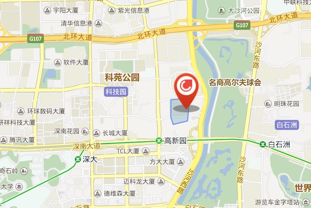

Keywords: Yii2, PHP, MySQL, jQuery, innobackupex, crontab, Swoole 
领先行业的O2O租房管理和销售系统

[产品网站](http://www.color520.com)

[手机版](http://m.color520.com)

## 所用到的技术

**Nginx**: 更先进的Web Server
**Yii2**: 专为Web2.0应用而设计的高性能PHP框架，内建超丰富建站feature。
**Swoole**: PHP语言的异步、并行、高性能网络通信框架,为PHP提供异步功能。
**crontab**: Linux定时任务工具
**Git**: 分布式版本控制系统
**MySQL**: 关系数据库
**XtraBackup**:开源的在线数据库备份解决方案

## 系统构架 

### 功能构架

用互联网思维打造高效O2O公寓管理平台

### 技术构架

功能清晰、高扩展性的系统构架

## 特色功能

COLOR公寓后台管理系统是由迈芒资产研发团队专为提高公寓运营效率而开发的后台管理系统，功能全面、运行稳定、扩展性强。根据上下游供应链顺序分为以下模块：物料采购管理，装修进度管理，房源管理，合同管理，消费订单管理，任务分配系统，报表数据管理等。

### 物料采购

每一件物品都可追溯到供应商

### 装修进度

实时监控供应链各环节的速度

### 任务分配

每次一带看房，都有详细记录。成功，则生成合同；失败，则追究原因。

### 合同管理

所有用户信息和合同均电子化。

### 房源管理

超多维的房屋信息，让租客通过网站即可订房。

### 消费账单管理

在COLOR的一切消费，均可在线支付。

## 我们如何开发

1. 我们研发团队就4个人，一个设计，3个开发。只花了3个月，但是我们网站的质量在租房行业也是屈指可数的。
3. 我们用Axure做原型设计，Worktile做任务管理。跟纯线上团队不同，我们有大量规章制度的文档，有道云笔记做文档管理，还挺方便，学习成本很低。
4. 用Scrum极限编程来管理团队。每日站立会议，来增进成员间的沟通，排查困难和阻碍。冲刺计划会议和冲刺总结会议，标志着一个冲刺周期的开始和结束，让团队时刻都有一个目标。

