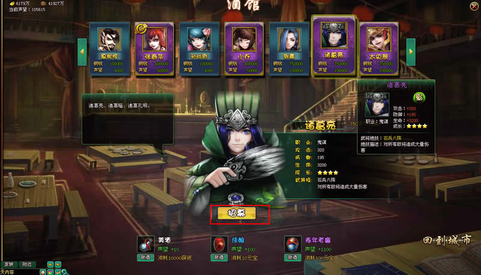

Status: public
title:  战三国项目介绍
Layout: one_page_site
Tag: AS3, 战三国, 完美世界, BoltEngine
description: 秒杀同行的BoltEngine地图引擎。轻量级的游戏UI系统。
---

[官网](http://zsg.173.com/)
[百度服务器](http://youxi.baidu.com/games/zsg/)
[51服务器](http://game.51.com/zsg/)

## 介绍

完美世界侵略火团队精心打造的三国题材RPG网页游戏。

月流水过亿，总用户20多万
在东南亚、东亚、欧洲、北美等8个国家上线，
400多个服务器共享竞技场。

## 秒杀同行的BoltEngine地图引擎

Bolt Engine 和配套地图编辑器由侵略火团队自主研发。  

利用**主动渲染**技术, 保证在同屏战斗人数达到**100人**依然不卡。
对应的地图编辑器，也让策划也可以顺利完成地图配置和调整工作，保证了开发的灵活性。

技术原理是: 对需要大量渲染的素材(主要是人物模型)只进行一次渲染, 获得每一帧的图像, 保存在内存里. 以后每次需要"渲染"的时候, 只需从内存中取出对应帧的图像, 显示在stage上.

## 轻量级的游戏UI系统

基于开源代码的轻量级UI库。除了基本的展示和响应操作，我们还借鉴了Flex的思想，实现了ItemRender、数据绑定、动态布局、事件冒泡等优秀的思想和机制。

开发出UI库后，我们还为其量身定做了可视化UI编辑器。我们用XML来描述拖拽操作后对应的UI层级树，然后生成对应的Sprite代码。

## 玩法系统介绍

### 武将系统

多达60多个武将，各有特长，增加收集的趣味。

### 布阵

3*3的矩阵上，每个点的武将可以灵活设置。通过分析对手，可达到田忌赛马的效果。

### 跨服竞技场

突破服务器的限制，不同服务器间的高端玩家可跨服挑战。

## 更多详情

[请看官网](http://zsg.173.com/)

